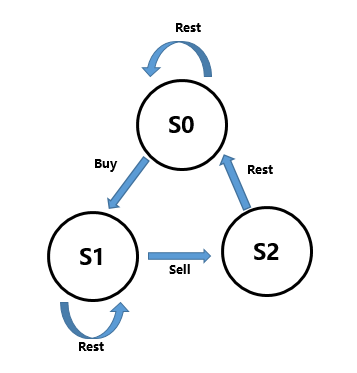

# LeetCode
刷题

## 提交代码
git add . <br/>
git commit -m "注释语句" <br/>
git pull origin master  <br/>
git push origin master  <br/>


### 摆动排序 II（参考网上代码）
- 题目：
给定一个无序的数组 nums，将它重新排列成 nums[0] < nums[1] > nums[2] < nums[3]... 的顺序 <br/>
- 难点：
用 O(n) 时间复杂度和 / 或原地 O(1) 额外空间来实现 <br/>
- 解题思路：
首先找出数组的中位数mid。然后将小于mid的数放在数组的偶数位置（0，2，4……），将大于mid的数放在数组的奇数位置（1，3，5……） <br/> 


### 有序矩阵中第K小的元素（自己做的，有待优化）
- 题目：
给定一个 n x n 矩阵，其中每行和每列元素均按升序排序，找到矩阵中第k小的元素。 <br/>
- 难点：
速度太慢，算法有待优化 <br/>
- 解题思路：
这个算法是自己做的（所以才慢233），很简单，从矩阵的左上角开始遍历，将当前坐标（i，j）的右方和下方的数放入priority_queue中。下一次执行时，从priority_queue中取出最小的数，然后重复执行，直至第k个数 <br/> 

### 寻找两个有序数组的中位数（参考网上代码）
- 题目：
给定两个大小为 m 和 n 的有序数组 nums1 和 nums2。请你找出这两个有序数组的中位数，并且要求算法的时间复杂度为 O(log(m + n))。 <br/>
- 难点：
这道题思考起来还是挺绕的，即使看了解析，在代码实现上还是有难度。 <br/>
- 解题思路：
大框架的思路采用二分法，对第K大的数进行二分。首先，对两个数组（暂且称为a、b）寻找第K/2大的数a_mid，b_mid，如果a_mid大于b_mid，那么第K大的数肯定不在b_mid前的数中，所以我们可以舍弃b的前K/2个数（相当于把B的指针向后移动K/2），然后K的值变为K-K/2，重复上述步骤。反之同理。<br/> 
这里要注意几个临界值的处理，首先是k=1的时候，就表示寻找第K大的数，所以只需要从当前a和b的第一个数中取最小的即可。其次是若a的当前索引超出了a的长度，那么说明第K大的数在b中，可以直接从B中求得，反之亦然。 <br/>

### 乘积最大子序列（参考网上代码）
- 题目：
给定一个整数数组 nums ，找出一个序列中乘积最大的连续子序列（该序列至少包含一个数）。 <br/>
- 难点：
好久没做动态规划的题了，今天一做有点手生，直接看了网上的代码 <br/>
- 解题思路：
看过解题思路后还是很简单的。用两个变量分别记录前一个数的最大数和最小数（因为存在负负得正的情况，所以要保存最小值），在遍历的时候让当前值分别和最大数和最小数相乘，并和当前值比较，选出选个数中的最大数和最小数，记录下新的最大值和最小值，并更新全局最大数 <br/> 

### Best Time to Buy and Sell Stock with Cooldown （参考网上代码）
- 题目：
给定一个整数数组，其中第 i 个元素代表了第 i 天的股票价格 .设计一个算法计算出最大利润。在满足以下约束条件下，你可以尽可能地完成更多的交易（多次买卖一支股票）: <br/>
--- 你不能同时参与多笔交易（你必须在再次购买前出售掉之前的股票）。<br/>
--- 卖出股票后，你无法在第二天买入股票 (即冷冻期为 1 天)。 <br/>
- 难点：
还是动态规划，感觉啥也不会了（越来越菜了） <br/>
- 解题思路：
从网上看到一个图，很清晰。在S0状态可以buy彩票进入S1状态或者什么都不做继续在S0状态；在S1状态可以通过卖出彩票进入S2状态或者什么都不做继续在S1状态；在S2状态通过冷冻期进入S0状态。<br/> <br/> 总结出状态转移方程：<br/>
---- S0[i]=max(S0[i-1],S2[i-1]) <br/>
---- S1[i]=max(S1[i],S0[i-1]-price[i]) <br/>
---- S2[i]=S1[i-1]+price[i] <br/>
---- 初始化状态为 S0[0]=0 , S1[0]=-price[0] , S2[0]=-∞<br/>

###  Perfect Squares（参考网上代码）
- 题目：
给定正整数 n，找到若干个完全平方数（比如 1, 4, 9, 16, ...）使得它们的和等于 n。你需要让组成和的完全平方数的个数最少。 <br/>
- 难点：
类似之前做过的给定一定数额的纸票，组成某个金额钱数的所需要的最少纸票张数。但还是没做出来，老了啊…… <br/>
- 解题思路（**两种**）：<br/>
--- 第一种：四平方和定理，任意一个正整数均可表示为4个整数的平方和，其实是可以表示为4个以内的平方数之和，那么就是说返回结果只有1,2,3或4其中的一个，首先我们将数字化简一下，由于一个数如果含有因子4，那么我们可以把4都去掉，并不影响结果，比如2和8,3和12等等，返回的结果都相同。另一个化简的地方就是，如果一个数除以8余7的话，那么肯定是由4个完全平方数组成（反过来也成立）。ok，if else + 一个while就能实现了…… <br/> 
--- 第二种：动态规划，每一个数（0和1除外），肯定可以写成一个数+一个完全平方数的形式，所以递推格式就出来了：<br/>
```
        for(int i=0;i<=n;i++){  //初始化dp[0],其他的为INT_MAX
            for(int j=1;i+j*j<=n;j++){
                dp[i+j*j]=min(dp[i+j*j],dp[i]+1) 
                }
        }
```
###  单词拆分（参考网上代码）
- 题目：
给定一个非空字符串 s 和一个包含非空单词列表的字典 wordDict，判定 s 是否可以被空格拆分为一个或多个在字典中出现的单词。 <br/>
- 难点：
不说了，这题直接看的网上解析，太菜太菜 <br/>
- 解题思路：
动态规划，没得说。问题是怎么动态规划？对字符串s做dp索引，dp[i]表示前i个字符（1~i）可以被拆分。如果dp[i]能被拆分，那么在wordDict中一定存在一个长度为k的单词，满足dp[k]也能被拆分（dp[0]初始化为可以拆分）。所以递推公式出来了：<br/>
```
        for(int i=0;i<=n;i++){  //初始化dp[0],其他的为INT_MAX
            for(int j=1;j<=最大单词长度&&j<=i;j++){
                if( dp[i-j]==ture && s.substr(i-j,j)在wordDict中 )  //substr(pos,len) 在字符位置pos开始，跨越len个字符
                dp[i] = true;
            }
        }
```
###  单词拆分 II（自己做的）
- 题目：
给定一个非空字符串 s 和一个包含非空单词列表的字典 wordDict，在字符串中增加空格来构建一个句子，使得句子中所有的单词都在词典中。返回所有这些可能的句子。 <br/>
- 难点：
自己做的，运行速度上等 <br/>
- 解题思路：
大思路跟昨天做的“单词拆分”是一样的，只是需要加一个“链表”result即可。即，如果dp[i]能被拆分，那么在wordDict中一定存在一个长度为k的单词，满足dp[k]也能被拆分，所以result[i]指向k，即result[i].push_back(k)。然后从最后一个字母开始往前推，将所有单词加上空格拼接起来即可。<br/>

###  戳气球（参考网上代码）
- 题目：
有 n 个气球，编号为0 到 n-1，每个气球上都标有一个数字，这些数字存在数组 nums 中。现在要求你戳破所有的气球。每当你戳破一个气球 i 时，你可以获得 nums[left] * nums[i] * nums[right] 个硬币。 这里的 left 和 right 代表和 i 相邻的两个气球的序号。注意当你戳破了气球 i 后，气球 left 和气球 right 就变成了相邻的气球。求所能获得硬币的最大数量。你可以假设 nums[-1] = nums[n] = 1，但注意它们不是真实存在的所以并不能被戳破。 <br/>
- 难点：
感觉跟之前的遇到过的”矩阵最大乘积“有点像，但还是做不出来233 <br/>
- 解题思路：
维护一个二维动态数组dp，其中dp[i][j]表示打爆区间[i,j]中的所有气球能得到的最多金币,先求得所有小区间的dp值，然后聚沙成塔，逐步推出大区间的dp值。如{3,1,5,8}的求解顺序应该为[3] -> [1] -> [5] -> [8] -> [3, 1] -> [1, 5] -> [5, 8] -> [3, 1, 5] -> [1, 5, 8] -> [3, 1, 5, 8]。用k来遍历区间内的每个气球，k在区间[i,j]中，假如第k个气球先被打爆，然后此时区间 [i, j] 被分成了两部分，[i, k-1] 和 [k+1, j]，只要我们之前更新过了这两个子区间的dp值，可以直接用 dp[i][k-1] 和 dp[k+1][j]。但是要注意，k周围的气球只能是第i-1个，和第j+1个了（因为[i,k-1]和[k+1,j]的气球都被打爆了）所以得分应为 nums[i-1] * nums[k] * nums[j+1]。放上递推的代码：<br/>
```
        for(int len=1;len<=length;len++)
	   for(int i=1;i<=length-len+1;i++)
	   {
	       int j=i+len-1;
	       for(int k=i;k<=j;k++)
	       {
	           dp[i][j]=max(dp[i][j],nums[i-1]*nums[k]*nums[j+1]+dp[i][k-1]+dp[k+1][j]);
	       }
	   }
 ```
### Remove Invalid Parentheses （参考网上代码）
- 题目：
删除最小数量的无效括号，使得输入的字符串有效，返回所有可能的结果。<br/>
- 难点：
有一点点思路，但就是想不出来 <br/>
- 解题思路：
给定字符串s。首先，设置一个浮标从左往右遍历字符串并随时记录左括号和右括号的数量。如果到某一个位置时，右括号的数量大于左括号的数量，那么就说明s的子串（位置0到当前位置）必然可以删除一个右括号来构造一个有效的字符串（左、右括号数量相等）。将构造的有效子串和s后面的字符串组成一个新的字符串重复递归。<br/> 
怎么删除一个右括号来构造一个有效的字符串？在删除括号的时候，为保证不会产生重复值，需要记录一个最后删除的位置，这样可以使得在接下来删除的时候只删除这个位置之后的右括号，从而使得当前这一段子串不再包含多余的右括号了。<br/>
最后还有一种情况是包含了多余的左括号，一种直观的方法是从右向左再按照上面的方法处理一遍左括号．只需要将数组逆置之后就可以重用上面的算法了。<br/>

### 通配符匹配 （参考网上代码）
- 题目：
给定一个字符串 (s) 和一个字符模式 (p) ，实现一个支持 '？' 和 '\*' 的通配符匹配。'?' 可以匹配任何单个字符。'\*' 可以匹配任意字符串（包括空字符串）。
两个字符串完全匹配才算匹配成功。<br/>
- 难点：
感觉凉了啊，这种难度的回溯都不会了，简直GG <br/>
- 解题思路：
找准递归串和特殊的递归点。对s进行遍历，'\*'是特殊的递归点。用两个指针s_r、p_r来遍历s和p，当s[s_r]和p[p_r]相等时，s_r和p_r均加一指向下一个位置；不相等时，若p[p_r]是'?'，那么s_r和p_r均加一指向下一个位置；若p[p_r]是'\*'号，则将p_r+1，并记录位置s_r和p_r为递归点（pre_s=s_r,pre_p=p_r），若p[p_r]是一个正常字符且有递归点，那么将s的递归点pre_s+1，然后再恢复递归点（s_r=pre_s，p_r=pre_p），若p[p_r]是一个正常字符但没有递归点，那么直接返回false<br/>
当s遍历完之后，若p也遍历完了或者p只剩下'\*'号了，那么返回true，否则返回false<br/>
